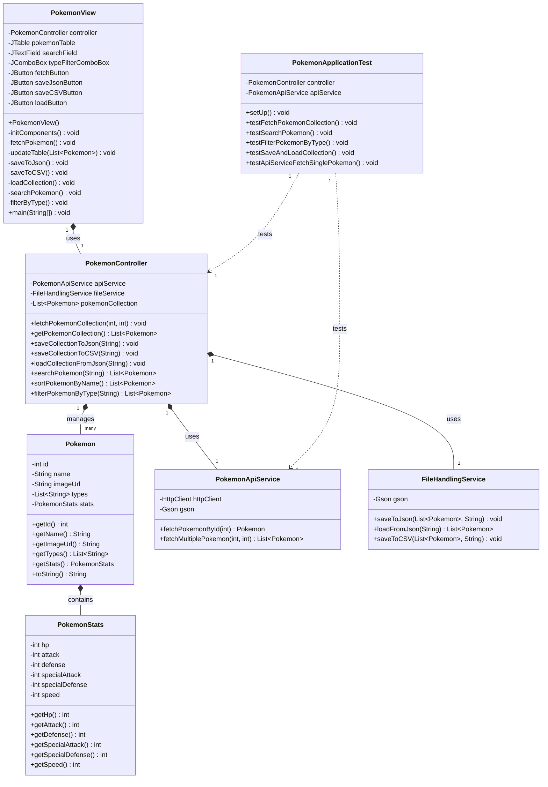

```mermaid
classDiagram
%% Relationships
    Pokemon *-- PokemonStats : contains
    PokemonController "1" *-- "1" PokemonApiService : uses
    PokemonController "1" *-- "1" FileHandlingService : uses
    PokemonController "1" *-- "many" Pokemon : manages
    PokemonView "1" *-- "1" PokemonController : uses
    PokemonApplicationTest "1" ..> "1" PokemonController : tests
    PokemonApplicationTest "1" ..> "1" PokemonApiService : tests
    
%% Model Classes
    class Pokemon {
        -int id
        -String name
        -String imageUrl
        -List~String~ types
        -PokemonStats stats
        +getId() int
        +getName() String
        +getImageUrl() String
        +getTypes() List~String~
        +getStats() PokemonStats
        +toString() String
    }

    class PokemonStats {
        -int hp
        -int attack
        -int defense
        -int specialAttack
        -int specialDefense
        -int speed
        +getHp() int
        +getAttack() int
        +getDefense() int
        +getSpecialAttack() int
        +getSpecialDefense() int
        +getSpeed() int
    }

%% Service Classes
    class PokemonApiService {
        -HttpClient httpClient
        -Gson gson
        +fetchPokemonById(int) Pokemon
        +fetchMultiplePokemon(int, int) List~Pokemon~
    }

    class FileHandlingService {
        -Gson gson
        +saveToJson(List~Pokemon~, String) void
        +loadFromJson(String) List~Pokemon~
        +saveToCSV(List~Pokemon~, String) void
    }

%% Controller Classes
    class PokemonController {
        -PokemonApiService apiService
        -FileHandlingService fileService
        -List~Pokemon~ pokemonCollection
        +fetchPokemonCollection(int, int) void
        +getPokemonCollection() List~Pokemon~
        +saveCollectionToJson(String) void
        +saveCollectionToCSV(String) void
        +loadCollectionFromJson(String) void
        +searchPokemon(String) List~Pokemon~
        +sortPokemonByName() List~Pokemon~
        +filterPokemonByType(String) List~Pokemon~
    }

%% View Classes
    class PokemonView {
        -PokemonController controller
        -JTable pokemonTable
        -JTextField searchField
        -JComboBox typeFilterComboBox
        -JButton fetchButton
        -JButton saveJsonButton
        -JButton saveCSVButton
        -JButton loadButton
        +PokemonView()
        -initComponents() void
        -fetchPokemon() void
        -updateTable(List~Pokemon~) void
        -saveToJson() void
        -saveToCSV() void
        -loadCollection() void
        -searchPokemon() void
        -filterByType() void
        +main(String[]) void
    }

%% Test Classes
    class PokemonApplicationTest {
        -PokemonController controller
        -PokemonApiService apiService
        +setUp() void
        +testFetchPokemonCollection() void
        +testSearchPokemon() void
        +testFilterPokemonByType() void
        +testSaveAndLoadCollection() void
        +testApiServiceFetchSinglePokemon() void
    }
```