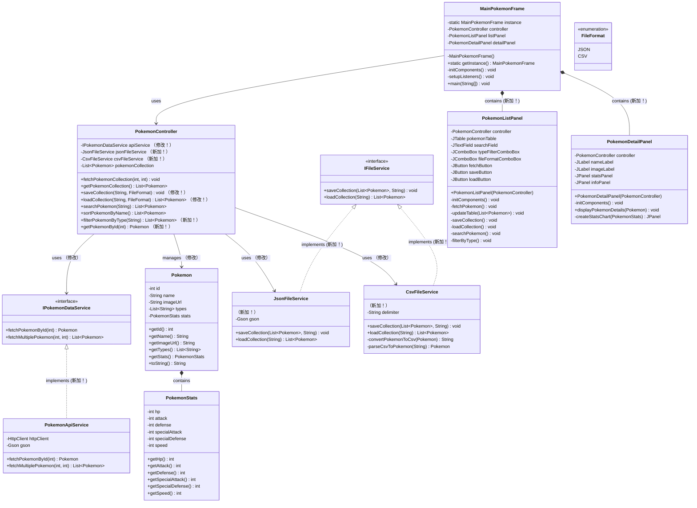

```mermaid
classDiagram
%% Relationships
    Pokemon *-- PokemonStats : contains
    IPokemonDataService <|.. PokemonApiService : implements (新加！)
    IFileService <|.. JsonFileService : implements (新加！)
    IFileService <|.. CsvFileService : implements (新加！)

    PokemonController --> IPokemonDataService : uses （修改）
    PokemonController --> JsonFileService : uses （修改）
    PokemonController --> CsvFileService : uses （修改）
    PokemonController --> Pokemon : manages （修改）

    MainPokemonFrame --> PokemonController : uses
    MainPokemonFrame *-- PokemonListPanel : contains (新加！)
    MainPokemonFrame *-- PokemonDetailPanel : contains (新加！)
    
%% Interface Classes (新加！)
    class IPokemonDataService {
        <<interface>>
        +fetchPokemonById(int) Pokemon
        +fetchMultiplePokemon(int, int) List~Pokemon~
    }

    class IFileService {
        <<interface>>
        +saveCollection(List~Pokemon~, String) void
        +loadCollection(String) List~Pokemon~
    }

    class FileFormat {
        <<enumeration>>
        JSON
        CSV
    }

%% Model Classes
    class Pokemon {
        -int id
        -String name
        -String imageUrl
        -List~String~ types
        -PokemonStats stats
        +getId() int
        +getName() String
        +getImageUrl() String
        +getTypes() List~String~
        +getStats() PokemonStats
        +toString() String
    }

    class PokemonStats {
        -int hp
        -int attack
        -int defense
        -int specialAttack
        -int specialDefense
        -int speed
        +getHp() int
        +getAttack() int
        +getDefense() int
        +getSpecialAttack() int
        +getSpecialDefense() int
        +getSpeed() int
    }

%% Service Classes
    class PokemonApiService {
        -HttpClient httpClient
        -Gson gson
        +fetchPokemonById(int) Pokemon
        +fetchMultiplePokemon(int, int) List~Pokemon~
    }

    class JsonFileService { （新加！）
        -Gson gson
        +saveCollection(List~Pokemon~, String) void
        +loadCollection(String) List~Pokemon~
    }

    class CsvFileService { （新加！）
        -String delimiter
        +saveCollection(List~Pokemon~, String) void
        +loadCollection(String) List~Pokemon~
        -convertPokemonToCsv(Pokemon) String
        -parseCsvToPokemon(String) Pokemon
    }

%% Controller Classes
    class PokemonController {
        -IPokemonDataService apiService （修改！）
        -JsonFileService jsonFileService （新加！）
        -CsvFileService csvFileService （新加！）
        -List~Pokemon~ pokemonCollection
        +fetchPokemonCollection(int, int) void
        +getPokemonCollection() List~Pokemon~
        +saveCollection(String, FileFormat) void （修改！）
        +loadCollection(String, FileFormat) List~Pokemon~ （修改！）
        +searchPokemon(String) List~Pokemon~
        +sortPokemonByName() List~Pokemon~
        +filterPokemonByType(String) List~Pokemon~ （新加！）
        +getPokemonById(int) Pokemon （新加！）
    }

%% View Classes （修改！采用singleton pattern和observer pattern）
    class MainPokemonFrame {
        -static MainPokemonFrame instance
        -PokemonController controller
        -PokemonListPanel listPanel
        -PokemonDetailPanel detailPanel
        -MainPokemonFrame()
        +static getInstance() MainPokemonFrame
        -initComponents() void
        -setupListeners() void
        +main(String[]) void
    }

    class PokemonListPanel {
        -PokemonController controller
        -JTable pokemonTable
        -JTextField searchField
        -JComboBox typeFilterComboBox
        -JComboBox fileFormatComboBox
        -JButton fetchButton
        -JButton saveButton
        -JButton loadButton
        +PokemonListPanel(PokemonController)
        -initComponents() void
        -fetchPokemon() void
        -updateTable(List~Pokemon~) void
        -saveCollection() void
        -loadCollection() void
        -searchPokemon() void
        -filterByType() void
    }

    class PokemonDetailPanel {
        -PokemonController controller
        -JLabel nameLabel
        -JLabel imageLabel
        -JPanel statsPanel
        -JPanel infoPanel
        +PokemonDetailPanel(PokemonController)
        -initComponents() void
        +displayPokemonDetails(Pokemon) void
        -createStatsChart(PokemonStats) JPanel
    }

```