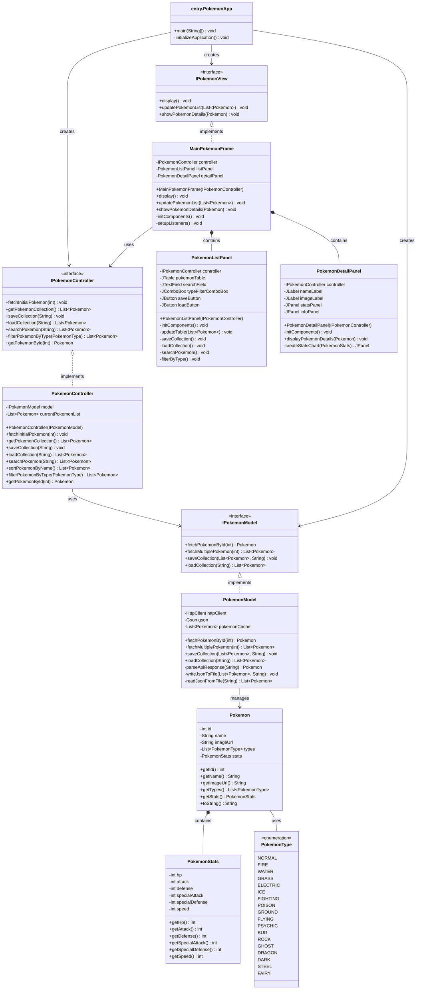

```mermaid
classDiagram
%% Relationships
    IPokemonModel <|.. PokemonModel : implements
    IPokemonController <|.. PokemonController : implements
    IPokemonView <|.. MainPokemonFrame : implements
    
    Pokemon *-- PokemonStats : contains
    Pokemon -- PokemonType : uses
    PokemonModel --> Pokemon : manages

    PokemonController --> IPokemonModel : uses

    entry.PokemonApp --> IPokemonModel : creates
    entry.PokemonApp --> IPokemonController : creates
    entry.PokemonApp --> IPokemonView : creates

    MainPokemonFrame --> IPokemonController : uses
    MainPokemonFrame *-- PokemonListPanel : contains
    MainPokemonFrame *-- PokemonDetailPanel : contains

%% Interface Classes
    class IPokemonModel {
        <<interface>>
        +fetchPokemonById(int) Pokemon
        +fetchMultiplePokemon(int) List~Pokemon~
        +saveCollection(List~Pokemon~, String) void
        +loadCollection(String) List~Pokemon~
    }

    class IPokemonController {
        <<interface>>
        +fetchInitialPokemon(int) void
        +getPokemonCollection() List~Pokemon~
        +saveCollection(String) void
        +loadCollection(String) List~Pokemon~
        +searchPokemon(String) List~Pokemon~
        +filterPokemonByType(PokemonType) List~Pokemon~
        +getPokemonById(int) Pokemon
    }

    class IPokemonView {
        <<interface>>
        +display() void
        +updatePokemonList(List~Pokemon~) void
        +showPokemonDetails(Pokemon) void
    }

%% Enums
    class PokemonType {
        <<enumeration>>
        NORMAL
        FIRE
        WATER
        GRASS
        ELECTRIC
        ICE
        FIGHTING
        POISON
        GROUND
        FLYING
        PSYCHIC
        BUG
        ROCK
        GHOST
        DRAGON
        DARK
        STEEL
        FAIRY
    }

%% Model Classes
    class Pokemon {
        -int id
        -String name
        -String imageUrl
        -List~PokemonType~ types
        -PokemonStats stats
        +getId() int
        +getName() String
        +getImageUrl() String
        +getTypes() List~PokemonType~
        +getStats() PokemonStats
        +toString() String
    }

    class PokemonStats {
        -int hp
        -int attack
        -int defense
        -int specialAttack
        -int specialDefense
        -int speed
        +getHp() int
        +getAttack() int
        +getDefense() int
        +getSpecialAttack() int
        +getSpecialDefense() int
        +getSpeed() int
    }

    class PokemonModel {
        -HttpClient httpClient
        -Gson gson
        -List~Pokemon~ pokemonCache
        +fetchPokemonById(int) Pokemon
        +fetchMultiplePokemon(int) List~Pokemon~
        +saveCollection(List~Pokemon~, String) void
        +loadCollection(String) List~Pokemon~
        -parseApiResponse(String) Pokemon
        -writeJsonToFile(List~Pokemon~, String) void
        -readJsonFromFile(String) List~Pokemon~
    }
    
%% Controller Classes
    class PokemonController {
        -IPokemonModel model
        -List~Pokemon~ currentPokemonList
        +PokemonController(IPokemonModel)
        +fetchInitialPokemon(int) void
        +getPokemonCollection() List~Pokemon~
        +saveCollection(String) void
        +loadCollection(String) List~Pokemon~
        +searchPokemon(String) List~Pokemon~
        +sortPokemonByName() List~Pokemon~
        +filterPokemonByType(PokemonType) List~Pokemon~
        +getPokemonById(int) Pokemon
    }

%% Entry Point
    class entry.PokemonApp {
        +main(String[]) void
        -initializeApplication() void
    }

%% View Classes
    class MainPokemonFrame {
        -IPokemonController controller
        -PokemonListPanel listPanel
        -PokemonDetailPanel detailPanel
        +MainPokemonFrame(IPokemonController)
        +display() void
        +updatePokemonList(List~Pokemon~) void
        +showPokemonDetails(Pokemon) void
        -initComponents() void
        -setupListeners() void
    }

    class PokemonListPanel {
        -IPokemonController controller
        -JTable pokemonTable
        -JTextField searchField
        -JComboBox typeFilterComboBox
        -JButton saveButton
        -JButton loadButton
        +PokemonListPanel(IPokemonController)
        -initComponents() void
        -updateTable(List~Pokemon~) void
        -saveCollection() void
        -loadCollection() void
        -searchPokemon() void
        -filterByType() void
    }

    class PokemonDetailPanel {
        -IPokemonController controller
        -JLabel nameLabel
        -JLabel imageLabel
        -JPanel statsPanel
        -JPanel infoPanel
        +PokemonDetailPanel(IPokemonController)
        -initComponents() void
        +displayPokemonDetails(Pokemon) void
        -createStatsChart(PokemonStats) JPanel
    }
```